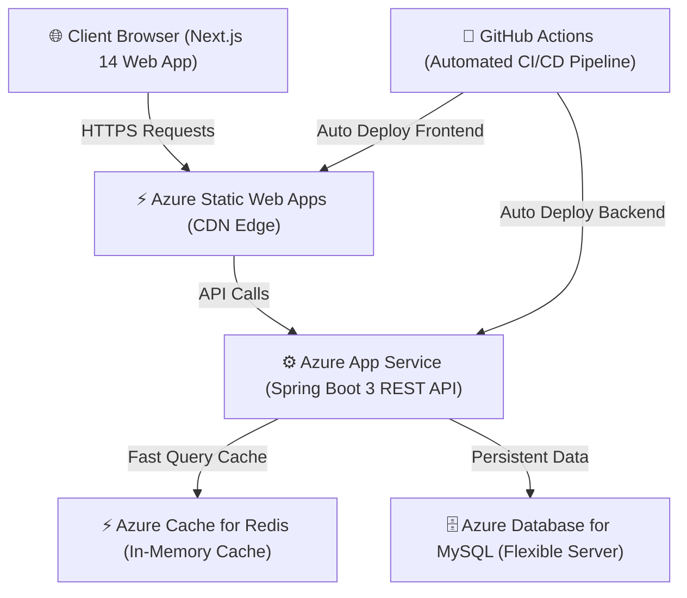

# LawyerConnect 🤝 — Enterprise Legal Tech Marketplace Platform

[](https://black-beach-0346be400.6.azurestaticapps.net)
[](https://nextjs.org/)
[](https://www.oracle.com/java/)
[](https://spring.io/projects/spring-boot)
[](https://redis.io/)
[](https://www.mysql.com/)
[](https://github.com/prashan7070/LawyerConnect/actions)

> A high-performance, enterprise-grade cloud platform connecting verified legal counsel with clients across Sri Lanka. Built on a decoupled monorepo architecture featuring **Next.js 14**, **Spring Boot 3**, **Redis Caching**, and automated **CI/CD on Microsoft Azure**.

---

## 🌐 Live Production Links

* **Frontend Web Application**: [https://black-beach-0346be400.6.azurestaticapps.net](https://black-beach-0346be400.6.azurestaticapps.net)
* **Backend REST API**: [https://lawyerconnect-backend-api.azurewebsites.net](https://lawyerconnect-backend-api.azurewebsites.net)
* **GitHub Repository**: [https://github.com/prashan7070/LawyerConnect](https://github.com/prashan7070/LawyerConnect)

---

## 🏗️ System Architecture



---

## ✨ Key Features & Engineering Highlights

* **Decoupled Monorepo Architecture**: Clean separation between the modern Next.js 14 React frontend and Java 17 Spring Boot 3 RESTful micro-services backend.
* **Multi-Role Dashboard System**: Dedicated, secure dashboard portals for **Clients**, **Lawyers**, and **System Administrators**.
* **High-Speed Redis Caching**: Integrated `@Cacheable` abstraction backed by **Redis** to eliminate redundant database reads for high-traffic advocate directory queries and profile lookups.
* **IP-Based Rate Limiting**: Custom thread-safe `RateLimitingFilter` enforcing request limits per IP address to safeguard sensitive endpoints against brute-force attacks and DDoS.
* **Stateless Security & RBAC**: Enforced stateless **JWT dual-token authentication**, **BCrypt password hashing**, and granular **Role-Based Access Control (RBAC)** via **Spring Security**.
* **Automated CI/CD Pipelines**: Zero-downtime continuous deployment workflows via **GitHub Actions** that automatically run JUnit 5/Mockito unit tests, compile production artifacts, and release to Azure on every `git push`.

---

## ☁️ Cloud Infrastructure (Microsoft Azure)

| Service | Technology Tier | Function |
| :--- | :--- | :--- |
| **Frontend Web Hosting** | Azure Static Web Apps (`Free`) | Global CDN hosting for Next.js frontend |
| **Backend Server** | Azure App Service (`Basic B1 - Linux, Java 17`) | Hosting Spring Boot 3 REST API service |
| **Database Tier** | Azure Database for MySQL Flexible Server (`Standard_B1ms`) | Production relational database engine |
| **Caching Layer** | Azure Cache for Redis (`Balanced B0`) | Sub-millisecond in-memory caching |
| **CI/CD Automation** | GitHub Actions Workflows | Automated build, test & cloud deployment |

---

## 💻 Tech Stack & Tools

* **Frontend**: Next.js 14, React 19, TypeScript, TailwindCSS 4, Framer Motion, Lucide Icons
* **Backend**: Java 17, Spring Boot 3, Spring Security 6, Spring Data JPA, Spring Cache, ModelMapper
* **Database & Caching**: MySQL 8.0, Azure Managed Redis
* **Security & Testing**: JWT (JSON Web Tokens), BCrypt, JUnit 5, Mockito
* **DevOps & Cloud**: Microsoft Azure, Docker, Docker Compose, GitHub Actions CI/CD

---

## 🚀 Local Development Setup

### Prerequisites

* **Java JDK 17** or higher
* **Node.js 20** or higher
* **Docker & Docker Desktop** (Optional, for containerized local execution)
* **MySQL 8.0** and **Redis Server**

### Option 1: Running with Docker Compose (Recommended)

```bash
# 1. Clone the repository
git clone https://github.com/prashan7070/LawyerConnect.git
cd LawyerConnect

# 2. Launch MySQL, Redis, Backend, and Frontend containers
docker-compose up -d --build
```

Access the local services at:
* **Frontend**: `http://localhost:3000`
* **Backend API**: `http://localhost:8080`
* **MySQL Database**: `localhost:3306`
* **Redis Cache**: `localhost:6379`

---

### Option 2: Running Services Manually

#### Backend (Spring Boot)

```bash
cd BackEnd/lawyerConnect_backend

# Build & Run Unit Tests
./mvnw clean test

# Run Spring Boot Application
./mvnw spring-boot:run
```

#### Frontend (Next.js)

```bash
cd lawyerconnect-frontend

# Install dependencies
npm install

# Start development server
npm run dev
```

---

## 🛡️ Security & Quality Standards

* **Standardized Exception Handling**: Implemented centralized `@RestControllerAdvice` returning structured error DTOs without leaking internal stack traces.
* **CORS Protection**: Enforced strict Cross-Origin Resource Sharing policy allowing requests strictly from configured client domain origins.
* **Unit Testing Coverage**: Automated unit tests built with JUnit 5 and Mockito to validate service logic and security filters prior to production deployment.

---

## 📜 License

This project is licensed under the **MIT License**.

---

*Architected & Developed with ❤️ for Sri Lanka's Legal Tech Ecosystem.*
