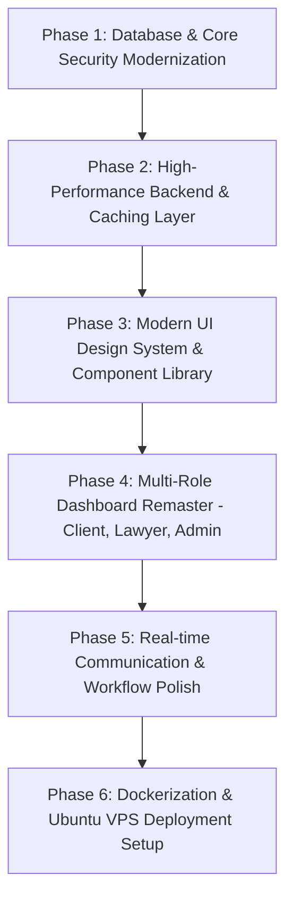

# 🚀 LawyerConnect Remaster — Enterprise Implementation Plan

## 📌 Executive Summary & Current State Audit

**LawyerConnect** is a legal consultation platform connecting clients with legal professionals. The current codebase consists of a Java Spring Boot backend (Spring Security, JWT, Spring Data JPA, MySQL) and a static HTML/CSS/JS frontend.

### 🔍 Current Gaps Identified in Existing Project:
1. **Missing Role & Security Gap**:
   - Only `LAWYER` and `CLIENT` roles exist in `Role.java`.
   - **No `ADMIN` role**, no admin authentication, and **no Admin Dashboard UI or API endpoints**.
   - CORS is restricted to static local dev port `http://localhost:63343`.
   - Simple single JWT token without Refresh Token mechanism or token revocation.
2. **Backend Performance & Resilience**:
   - **Zero Caching Layer**: Every request for lawyer listing, profile, and specialization queries hits MySQL directly.
   - **Lack of Rate Limiting & Input Validation**: Vulnerable to brute force and invalid payload submissions.
   - Direct entity exposure in some service layer calls without clean DTO mapping.
3. **UI / UX Aesthetics**:
   - Current UI uses basic HTML/CSS layouts that do not reflect modern SaaS web apps.
   - Lacks real-time data visualizers (charts, analytics cards, activity timelines).
   - Inconsistent design system (colors, typography, component states, dark/light theme options).
4. **DevOps & Deployment**:
   - No Dockerization or production environment configuration (`application-prod.yml`).
   - Missing Nginx reverse proxy configuration and systemd service scripts for deployment on Ubuntu VPS.

---

## 🎯 Remaster Vision & Key Objectives

Transform LawyerConnect into an **Industry-Grade, Production-Ready SaaS Platform** with:
- 👑 **3 Dedicated Dashboards**: **Admin**, **Lawyer**, and **Client**.
- 🛡️ **Enterprise Security**: Role-Based Access Control (RBAC), JWT Refresh Tokens, BCrypt password hashing, Spring Rate Limiting.
- ⚡ **High Performance Caching**: Redis / Spring Cache integration for ultra-fast lawyer discovery and search.
- 💎 **Modern Dynamic UI**: Glassmorphism aesthetic, modern CSS design tokens, dynamic stats visualizers, responsive sidebars, micro-animations, and clean modal workflows.
- 🐳 **Production & Cloud Deployment**: Dockerized container setup (Docker Compose with Spring Boot, MySQL, Redis, Nginx) ready for Ubuntu Server hosting.

---

## 📅 Multi-Phase Roadmap

---

## 🛠️ Detailed Breakdown of Phases

### 🔹 Phase 1: Database & Core Security Modernization
- **Task 1.1: Database Schema Expansion**
  - Add `ADMIN` to `Role` enum in backend.
  - Update `User` entity to include `createdAt`, `updatedAt`, `status` (`ACTIVE`, `SUSPENDED`, `PENDING_VERIFICATION`).
  - Expand `LawyerProfile` with verification status (`isVerified`), bar association registration details, rating counters, and fee details.
  - Create database migration script / SQL seed data for default Admin user (`admin@lawyerconnect.com`).

- **Task 1.2: Enhanced JWT & RBAC Auth Architecture**
  - Implement Dual-Token system: Short-lived Access Token (15 mins) + Long-lived Refresh Token (7 days).
  - Update `JwtAuthFilter` and `SecurityConfig` with strict method security `@PreAuthorize("hasRole('ADMIN')")`.
  - Secure endpoints per role:
    - `/api/v1/admin/**` -> `ADMIN` only
    - `/api/v1/lawyer/**` -> `LAWYER` only
    - `/api/v1/client/**` -> `CLIENT` only

---

### 🔹 Phase 2: High-Performance Backend & Caching Layer
- **Task 2.1: Spring Cache & Redis Integration**
  - Integrate Spring Cache (`@Cacheable`, `@CacheEvict`) for high-traffic read operations:
    - Specialization categories list
    - Verified lawyer directory and search results
    - System statistics summary
  - Evict cache on profile updates or status changes to maintain cache consistency.

- **Task 2.2: Production Resilience & Validation**
  - Integrate `spring-boot-starter-validation` for input validation (`@Valid`, `@NotNull`, `@Email`, `@Size`).
  - Add Global Exception Handler (`@RestControllerAdvice`) returning standardized JSON error responses.
  - Implement Rate Limiting for auth endpoints.

---

### 🔹 Phase 3: Design System & Modern UI Foundations
- **Task 3.1: Modern Design System (`index.css` / CSS Custom Properties)**
  - Establish curated color palette: Deep Slate (#0F172A), Electric Indigo (#6366F1), Emerald Accent (#10B981), Warm Gold (#F59E0B).
  - Modern Glassmorphism variables (`backdrop-filter`, subtle borders, soft shadows).
  - Standardized component styling: Custom inputs, pills, buttons, tables, modal overlays, and toast notifications.
  - Inter & Outfit Google Fonts integration.

- **Task 3.2: Reusable UI Shell & Navigation**
  - Common top bar with notifications popover, profile dropdown, quick search, and live server status indicator.
  - Responsive collapsible sidebar tailored per user role.

---

### 🔹 Phase 4: Multi-Role Dashboard Remastering

#### 1️⃣ Client Dashboard Remaster (`clientDashboard.html` + JS)
- **Features**:
  - Hero search bar with Filter by Specialization, Location, Experience, Fee range.
  - Interactive Lawyer Cards with availability status badges, star ratings, and fee calculator.
  - Modern Appointment Scheduler modal with date pickers & session time slot selector.
  - Active Bookings Management tab with status filters (`PENDING`, `CONFIRMED`, `COMPLETED`, `CANCELLED`).
  - Client profile editor with avatar upload preview.

#### 2️⃣ Lawyer Dashboard Remaster (`lawyerDashboard.html` + JS)
- **Features**:
  - Executive Overview KPI Cards: Total Consultations, Monthly Revenue, Pending Requests, Client Rating.
  - Interactive Availability Schedule Manager (Set online & in-person hours per day).
  - Booking Request Manager (One-click Accept / Reject / Reschedule with client note).
  - Practice Profile Manager (Update bio, hourly rates for online/in-person, specializations).

#### 3️⃣ BRAND NEW Admin Dashboard (`adminDashboard.html` + JS)
- **Features**:
  - Platform Health & KPI Summary: Total Users, Total Lawyers, Total Bookings, Platform Revenue.
  - Lawyer Verification Queue: Review lawyer credentials, license numbers, approve/reject applications.
  - User & System Management: View all clients & lawyers, toggle account active/suspend status.
  - Global Specialization Management: Add/edit legal practice areas.

---

### 🔹 Phase 5: Containerization & Deployment Strategy
- **Task 5.1: Docker & Compose Setup**
  - Create multi-stage `Dockerfile` for Spring Boot application.
  - Create `docker-compose.yml` orchestrating: Backend, MySQL 8, Redis, and Nginx Web Server.
- **Task 5.2: Deployment Guide & Ubuntu Script**
  - Write complete step-by-step guide for hosting on Ubuntu VPS (DigitalOcean/AWS/Hetzner) or free hosting.

---

## 🔐 User Approval & Handoff

Please review this implementation plan. Once you approve, we will begin execution systematically step by step starting with **Phase 1 (Database & Backend Security Modernization)**!
